# Titanic
Data Analysis on Kaggle Dataset Titanic

## Introduction
The RMS Titanic was a British passenger ship that hit an iceberg on its maiden voyage and sank in 1912. It was the largest passenger ship afloat at the time and its sinking claimed the lives of over 1500 people, making it one of the worst maritime accidents in history. 

Kaggle, one of the foremost websites dedicated to data science and machine learning, provides a dataset on the passengers of the Titanic including whether the passenger survived or not, his/her age, the passenger's gender, ticket price, etc. We will use the data that Kaggle provides us to attempt to predict whether a passenger survived or not and which factors are significant to survival. 

The investigation will be broken down into these five stages:
1. Defining the problem
2. Get the data
3. Data exploration
4. Model the data

### Defining the Problem
The topic we would like to explore in this project is to see if we can predict the survival of the Titanic passengers based on the data we have been given. If we know the personal statistics of a passenger, can we reasonably predict if the passenger survived or not?

### Get the Data
Usually this section would be much more involved. Thankfully in this case, the data is already provided for us by Kaggle: [Kaggle](https://www.kaggle.com/c/titanic/data)

The data provided by Kaggle is also structured. They provide us with both a training data set and a test dataset for which we can test our modeling on. 
The Kaggle data provides whether the passenger survived or not, as well as other characteristics of the passenger such as gender, parch (# of parents/children on board), sibsp (# of siblings and spouses on board), and cabin number.
### Data Exploration
Here we explore what is the data available to us. We start by using pandas functions .info() and .head() to get below data

info()

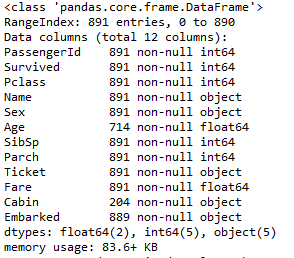

head()

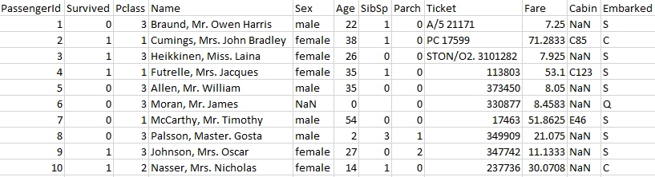

From the above we can see the type of data we have. First we note that there are 891 entries. Moreover, we are missing some data. The data for "Cabin", we only have 204 of the 891 entries.
Seems that this is one column we can drop as we don't even have a quarter of the data.

We are also missing a good chunk of data from "Age". However, the vast majority of the entries are there so perhaps we can still draw some conclusions from this data still

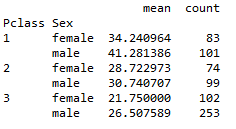
Above we note that we have most of the data for Age. It would be a shame not to use this information. So we construct estimates for the Ages that we are missing using the graph above.

For a given passenger missing the age data, we substitute using the mean age for his/her class and gender.  

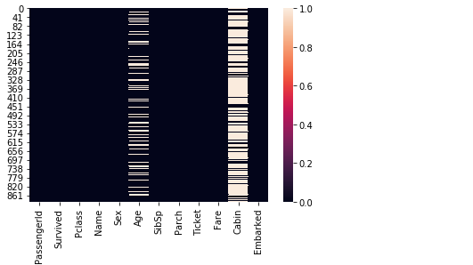
We make a heatmap of the null values of the data above. We can see that indeed we are missing most of the Cabin data and a lot of the Age data. 
Obviously the Cabin data can be very important to determining who survives. Unfortunately we are missing most of the data so the conclusions we can draw are limited.
We are missing some of the Age data. However, we may be able to extrapolate some of the data

#### Age & Gender

Survival by Age and Sex Facet Grid
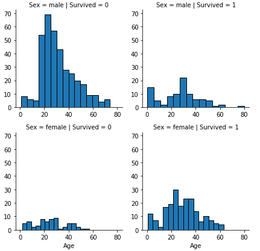

Survival by Age
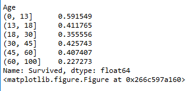

Survival by Age and Sex Bar Graph
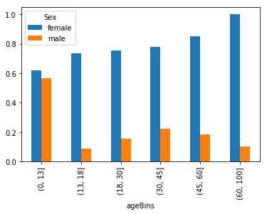

* From the above we can clearly conclude that there is strong correlation between survival rates and gender. From the first graph, seems that survival is greater for female than male for almost all ages
* We notice a trend in the third graph. For females, seems that the survival rate rose by age
* On the other hand, the trend is less obvious for males. Initially, the survival rate is quite high for young boys. Then there is a huge drop for adult men that rises slightly until 45 when it drops again
* Seems that the survival rate for boys is quite high comparatively. This makes sense as on the Titanic, women and children were allowed on lifeboats first. We don't see the same trend for young girls
* The second chart shows survival by age. Again we see young children have the highest survival rate. The survival rate is a bit spotty for the rest of the ages before dropping for 60+

-Overall from this information we conclude a few on variables. The age and survival rate correlation is spotty in the middle. So we break up age into kid, adult, and elderly. 
-In addition, we add a variable called MalexKid. We notice an interaction effect for gender and age. Seems that boys survive at a much higher rate. We don't see the same effect for girls. So we add this interaction effect to account for this.

#### Survival by Various Metrics
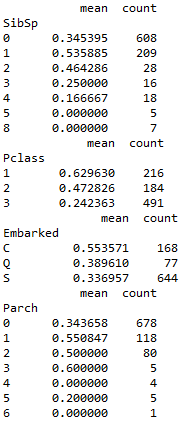

* SibSp represents the # of siblings and spouse that are on the Titanic for each passenger.
* We notice that for passengers without siblings or spouses, the survival rate is 0.35. When passengers have 1 or 2 relatives, the survival rate increases before decreasing again
* Thus we can perhaps add two categorical variables for passengers without SibSp and for passengers with 1 or 2 SibSp
* From Pclass, we can easily see that the higher class passengers survived at a higher rate. So we introduce two categorical variables: Class1 and Class2
* From this we see that passengers that came from port C > port Q > port S in terms of survival. We add two categorical variables to cover the three possible ports of embarkation
* Looking at Parents/Children, we can see that passengers with 0 Parch has a lower survival rate. The survival rate is highest for those with 1 parent/child. These are most likely the nuclear families. 
* Thus we create two categorical variables to cover the 0 Parch and 1 Parch cases

#### Fares
Fares Histogram
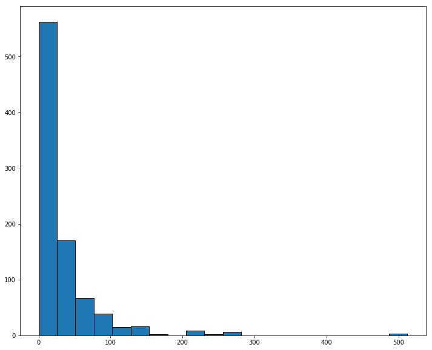

Survival by Fares
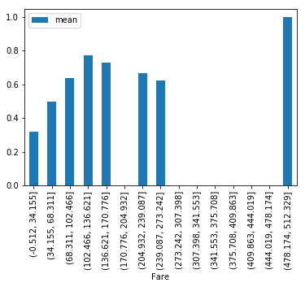

* Looking at the distribution of fares in the histogram, we can see that generally the fares are on the lower end. The vast majority of the passengers paid less than 100
* Indeed, most of the passengers paid less than $20 for their tickets
* Looking at the survival rate, it does seem that fares have some correlation with survival rate, but up to a point. The passengers that paid 100 or less seem to have died at a disproportionate rate. However, this trend disappears above 100
* We ignore the outliers survival rate of the highest fare

#### Suffix
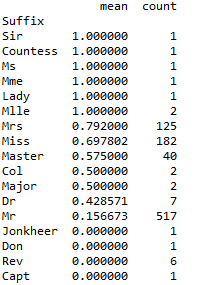

* We first note that the names of the passenger are not quite useful since they are not quantitative. And indeed, it shouldn't make a difference if a passenger is named Jason or James
* However, we do note that the passengers names given also include their "Suffix" or the title that they are addressed by
* We use python's "re" library to match out the "Suffixes" of these passengers and we get the survival rates of each. We get the above chart

* We note that we again see the gender split. Mrs, Miss tend to survival at a much higher rate than Mr
* We note for women that married women and higher class tend to be more likely to survive (Mrs, Mlle, Ms, Mme vs Miss)
* We also see that members of the crew tend to survive at a lower rate: Capt, Rev, Don, Jonkheer, Dr
* We thus make two additional categorical variables. One for higher class and married women. The other for members of the crew
* We do not need to separate out by gender as we are already including gender as a categorical variable. Separating them out here would only cause potential multicollinearity and increase standard error

### Model the Data

Here we actually model the data for the Titanic. There's several models that we can use to model this. I choose two below:

#### Logistic Regression
Logistic Regression is the most obvious choice for this classification model problem. Logistic regression is ideal for data where the logit odds are linear. Here we attempt to model the data with logistic regression

Using scikit-learn, we model the data using Logistic Regression. We achieve the below results on the training data set:
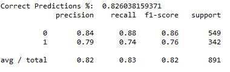

We see that overall this prediction is decent with nearly 83% accuracy on the training dataset. 
The recall is a bit lower for the survivors which suggests that the regression can do better at capturing when a passenger survives

Finally, we apply the fitted logistic regression on the test data. The accuracy is **77.5%**

#### K Nearest Neighbors
K Nearest Neighbors is another model for classification problems. Unlike logistic regression, Nearest Neighbors does not assume a functional form for the data

For the K Nearest Neighbors method, we must choose the number of neighbors as the only parameter. To do this, we use the **Elbow Method** to see what is the lowest error rate by neighbors

We use **9-fold cross validation** for calculating the error rate. We get the below:
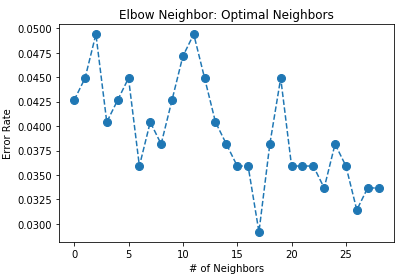

We see that the lowest error rate is 17. So we use 17 as the parameter for Nearest Neighbor (based on the 9-fold cross validation)

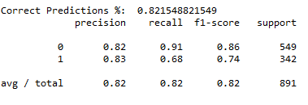

The predictive power of the K Nearest Neighbor is slightly weaker as can be seen. The accuracy is 82% for the training data
Again, recall is low for the predicting survivors at only 68%. Only 68% of survivors of the dataset were correctly predicted

We apply the fitted nearest neighbor on the test data. The accuracy is **76%*

#### Summary
Overall, we used logistic regression with multiple variables to achieve an accuracy of 77.5% of predictions for survivors of the Titanic.

Using 9-fold cross validation, we chose to use 17 as the parameter for K Nearest Neighbor. With 17 neighbors, we see that the accuracy is 76% which is lower.

In this case, it seems that Logistic Regression is the better predictive modeling for Titanic survivors.
